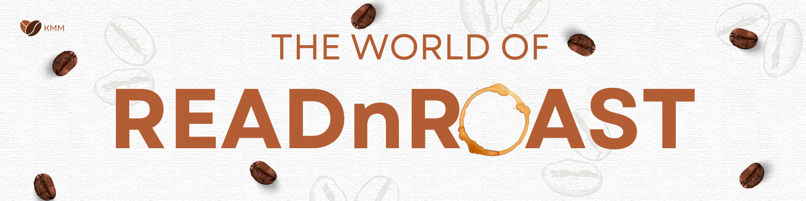

*Mateusz Jędrkowiak, Karolina Kulas & Mateusz Markiewicz*

*Jagiellonian University, 2025* 
#  

  

<h1 align="center">Your Ultimate Destination for Books, Coffee, and Community</h1>

Welcome to an online store that brings together book lovers and coffee enthusiasts in one unique space. Here, you can purchase your favorite books, discover new coffee blends, engage in meaningful discussions with like-minded individuals, and even contribute to a sustainable lifestyle by selling pre-loved items.

  

# Features

### ☕ Buy Books

Explore our carefully curated collection of books across various genres. Whether you're into fiction, non-fiction, self-development, or poetry, we've got something for everyone!

### ☕ Choose from Premium Coffee Selection

Pair your reading experience with the perfect cup of coffee. Choose from a variety of premium coffee beans and blends sourced from the best roasters.

### ☕ Join the Forum

Connect with fellow book lovers and coffee enthusiasts in our interactive forum. Share reviews, discuss your favorite books, exchange coffee brewing tips, and be part of a passionate community.

### ☕ Sell Pre-Loved Items 

We believe in sustainability! List your old books, coffee accessories, and other related items for auction. Give them a new home and contribute to reducing waste while supporting the sharing culture.

  

# Get Started

* Sign Up – Create your account to start shopping, chatting, and selling.

* Browse & Buy – Explore our extensive collection of books and coffee.

* Engage with the Community – Join discussions and share your thoughts.

* Sell & Share – List your old books and coffee-related items for sale.

Join us today and be part of a movement that celebrates literature, coffee, and sustainability!

  

*Mateusz Jędrkowiak, Karolina Kulas & Mateusz Markiewicz*

*Jagiellonian University, 2025* 

